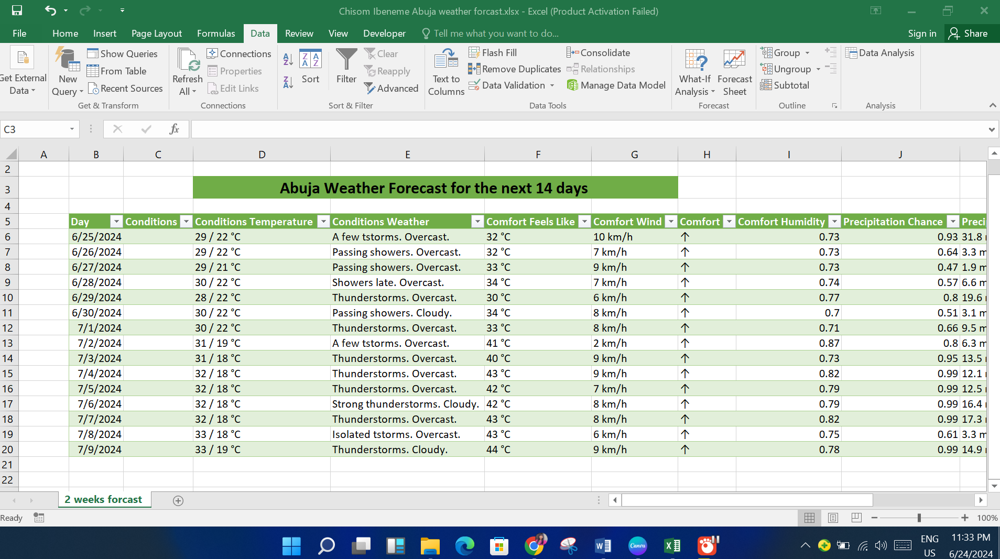

# Abuja_Weather_Forecast
Abuja Weather Forecast for the next 14 days 

## Introduction

Here is a weather forecast project, where I provided an up-to-date 14-day weather forecast for Abuja. This project demonstrates my ability to import and manage data using Excel, ensuring that the forecast information is always current through automated refreshes.

See full view [Here](https://docs.google.com/spreadsheets/d/1XhSqosIae2Flh3ajoUUzV5WXEpVQBb24/edit?usp=drive_link&ouid=104519991031043654505&rtpof=true&sd=true)

## Overview 

In this assessment, I imported weather data from Google into Excel, setting up the system to refresh the data every 2 hours and allowing manual refreshes whenever needed. This setup ensures that the weather forecast is consistently accurate and up-to-date.

## Key Features Demonstrated

- Data Import: Weather data for Abuja is imported directly from Google into Excel.
- Automated Refresh: The data is set to refresh automatically every 2 hours.
- Manual Refresh Option: Users can manually refresh the data at any time to get the latest weather updates.
- 14-Day Forecast: Provides a detailed forecast for the next 14 days, including temperature, precipitation, humidity, and more.

## Skills and Techniques

- Excel Data Import: Utilized Excel's data import functionality to pull weather data from Google.
- Automation: Set up automated refreshes using Excel's scheduling features.
- Data Management: Ensured data integrity and accuracy through regular updates and manual checks.

## How to use

- Automatic Refresh: The weather data will automatically refresh every 2 hours.
- Manual Refresh: To manually refresh the data, simply click the refresh button in the Excel toolbar.

## In Summary

This project showcases my skills in data importation, automation, and real-time data management using Excel. I hope you find it useful and insightful.

